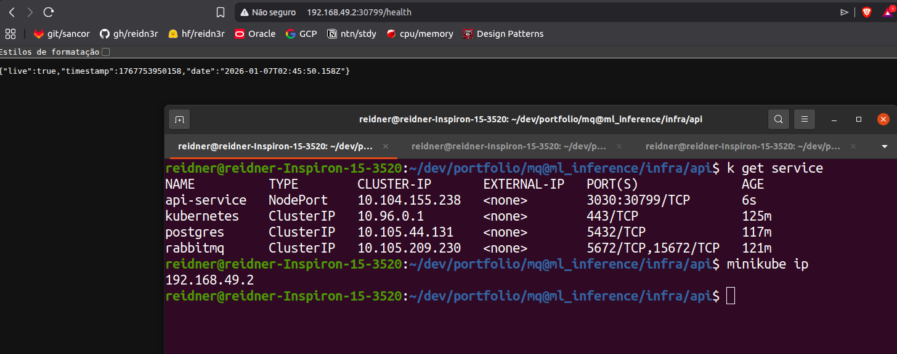
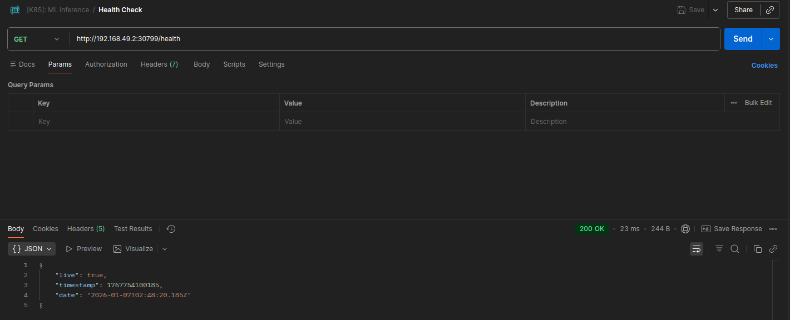
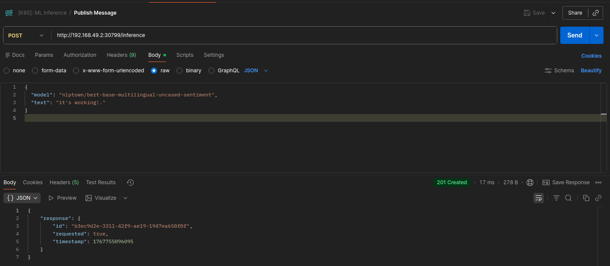
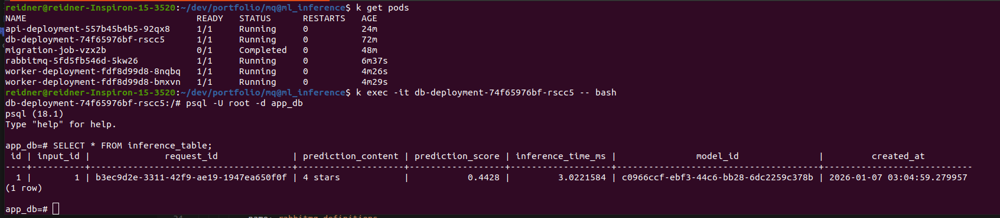
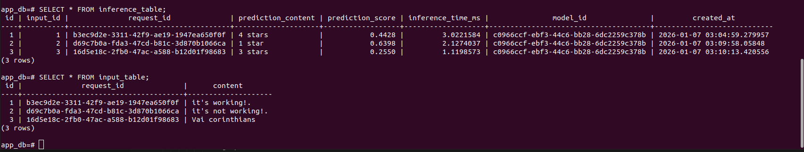

# Inference API

## Visão Geral

Este projeto implementa uma **plataforma para orquestração de inferências de modelos de linguagem**, projetada com foco em desacoplamento e processamento assíncrono.

A solução permite que o processamento de inferência (em CPU) seka executado de maneira assíncrona por workers especializados, enquanto requisições são enviadas de forma síncrona via API HTTP. 

O sistema é composto por:

* **API Web**: Responsável por receber requisições de inferência e publicar mensagens no broker.
* **Message Broker (RabbitMQ)**: Camada de mensageria para desacoplamento entre entrada de requisições e processamento.
* **Workers de Inferência**: Serviços responsáveis por consumir mensagens, executar inferências em modelos de linguagem e persistir os resultados.
* **Banco de Dados PostgreSQL**: Armazenamento relacional dos resultados de inferências.

Todo o ecossistema é provisionado e operado em um **cluster Kubernetes (Minikube)**

## Infraestrutura e Orquestração (Kubernetes)

A infraestrutura do projeto é declarativa e provisionada via Kubernetes, utilizando manifestos YAML. Cada recurso possui uma responsabilidade clara dentro do cluster.

### Deployments

Os arquivos `deployment.yml` definem o ciclo de vida dos principais componentes:

* **API**: Executada como um Deployment e associada a um service.
* **Workers**: Conjunto de réplicas que consomem mensagens da fila, podendo ser escaladas de forma independente da API.
* **RabbitMQ**: Broker de mensagens configurado para operar de forma estável dentro do cluster.
* **PostgreSQL**: Banco de dados relacional executando em um pod dedicado.

### Services

Os arquivos `service.yml` expõem os componentes internamente no cluster e, quando necessário, externamente:

* A **API** é exposta via **NodePort**, permitindo acesso externo para testes e integração (ex.: Postman ou browser).
* Workers, RabbitMQ e PostgreSQL são expostos como serviços internos, garantindo comunicação segura entre os pods.

### ConfigMaps

Os ConfigMaps são utilizados para armazenar configurações não sensíveis.

* Exemplo: Definições do RabbitMQ (exchanges, filas e bindings).

### Secrets

As variáveis sensíveis (credenciais, URLs, tokens) são definidas originalmente em arquivos `.env` e declaradas em Secrets, garantindo principalmente separação entre código e variáveis de ambiente.

### Persistent Volumes e Claims

* **PersistentVolume (PV)**: Define o recurso físico ou lógico de armazenamento.
* **PersistentVolumeClaim (PVC)**: Vincula o PostgreSQL a esse volume.

Tem como finalidade assegurar que os dados do banco não sejam perdidos em reinicializações ou recriações de pods.

### Job de Migração de Banco de Dados

O arquivo `migration-job.yml` define um Job responsável por executar as migrações de banco de dados utilizando **Alembic**:

## Ciclo de Vida de Desenvolvimento (CI/CD)

O projeto conta com uma **pipeline de CI/CD automatizada**.

* **CI**:

  * Build das imagens Docker da API e do Worker.
  * Para a API, é aplicado **versionamento semântico automático**, que define a tag da imagem de forma consistente
* **CD**:

  * Publicação das imagens Docker em um **Container Registry (Dockerhub)**.
  * API e Worker possuem imagens independentes, permitindo deploys e rollbacks isolados.

## Configuração e Implantação

A implantação do projeto é realizada diretamente no cluster Kubernetes, de forma declarativa.

Em alto nível, o processo consiste em:

1. Criar os **Secrets** a partir dos arquivos `.env` correspondentes a cada componente.
2. Aplicar os manifestos Kubernetes organizados por diretório (API, banco, broker, worker).
3. Executar o Job de migração para preparar o schema do banco de dados.
4. Validar a exposição da API via NodePort para acesso externo.

Todo o ambiente pode ser reproduzido de forma consistente em diferentes clusters.

## Verificação e Operação

A seguir estão evidências práticas da operação do sistema dentro do cluster Kubernetes.

### Health Checks da API

A API expõe endpoints de saúde que permitem validar rapidamente seu estado operacional.

**Acesso via browser:**

**Acesso via Postman:**

Esses endpoints confirmam que a API está ativa, acessível externamente via NodePort e corretamente integrada ao cluster.

---

### Publicação de Requisição de Inferência

O envio de uma requisição de inferência é realizado via `POST /inference`, contendo o modelo e o texto de entrada.

Após o envio, a mensagem é publicada no RabbitMQ e processada de forma assíncrona pelos workers.

---

### Persistência dos Resultados no Banco de Dados

Os resultados das inferências são persistidos no PostgreSQL executando dentro do cluster Kubernetes, validando o fluxo completo da aplicação.

**Registro individual de inferência:**

**Múltiplos registros persistidos:**

